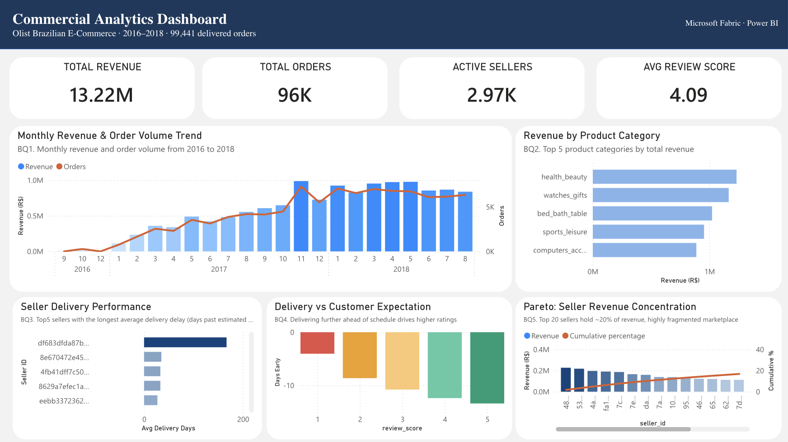
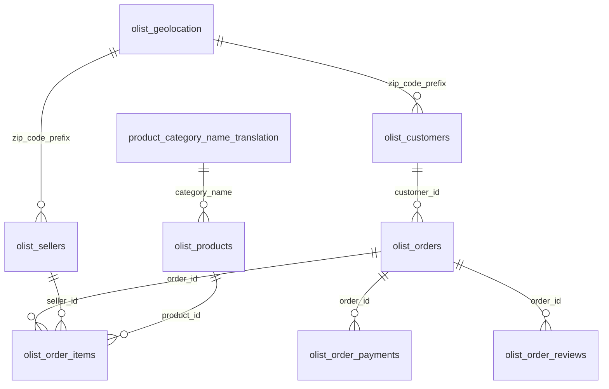

# Commercial Analytics Pipeline
### Olist Brazilian E-Commerce · Microsoft Fabric · Power BI



---

## Overview

End-to-end analytics pipeline built on **Microsoft Fabric**, transforming raw e-commerce transaction data into a structured Gold layer and an interactive Power BI dashboard. The project covers the full analytics engineering workflow: data ingestion, multi-stage transformation, semantic modelling, and business intelligence delivery.

**Dataset:** [Olist Brazilian E-Commerce](https://www.kaggle.com/datasets/olistbr/brazilian-ecommerce) — 100K+ orders placed between 2016 and 2018 across multiple marketplaces in Brazil.

---

## Architecture — Medallion Pattern

```
Raw CSV files
     │
     ▼
 BRONZE layer        — Ingested as-is into Fabric Lakehouse Delta tables
     │
     ▼
 SILVER layer        — Cleaned, typed, joined, and filtered to delivered orders only
     │
     ▼
  GOLD layer         — Aggregated, business-ready tables (one per business question)
     │
     ▼
Power BI dashboard   — Direct Lake semantic model, no data duplication
```

Each layer is materialised as Delta tables in the Fabric Lakehouse, with transformation logic written in Spark SQL notebooks.

---

## Data Sources

**Dataset:** Brazilian E-Commerce Public Dataset by Olist
**Source:** Kaggle (517,000+ downloads)
**Tables:** 9 relational tables, ~100,000 orders

| Table | Description |
|---|---|
| olist_orders | Central table — one row per order, tracks full delivery journey |
| olist_order_items | One row per item within an order, price and freight per item |
| olist_customers | Customer location and unique identity |
| olist_sellers | Seller location information |
| olist_products | Product categories and physical dimensions |
| olist_order_payments | Payment method and value per order |
| olist_order_reviews | Customer review scores and timestamps |
| olist_geolocation | Zip code to city/state/coordinates mapping |
| product_category_name_translation | Portuguese to English category translation |

---

## Schema — Entity Relationship Diagram



---

## Tech Stack

| Layer | Tool |
|---|---|
| Storage & compute | Microsoft Fabric Lakehouse (Delta tables) |
| Transformation | Spark SQL (PySpark notebooks) |
| SQL development | DataGrip (JetBrains) |
| Semantic model | Direct Lake (Power BI) |
| Visualisation | Power BI |
| Version control | GitHub |

---

## Business Questions

| # | Question | Chart type |
|---|---|---|
| BQ1 | How has monthly revenue and order volume evolved from 2016 to 2018? | Combo chart (bar + line) |
| BQ2 | Which product categories generate the most revenue? | Horizontal bar chart |
| BQ3 | Which sellers have the longest average delivery delay past the estimated date? | Horizontal bar chart |
| BQ4 | Does delivering ahead of the estimated date drive higher customer ratings? | Clustered bar chart |
| BQ5 | How concentrated is revenue across sellers? | Pareto chart (bar + cumulative line) |

---

## Key Findings

- **R$13.22M** total revenue across **99,441** delivered orders from **2,970** active sellers
- Revenue grew consistently from late 2016, peaking in **November 2017**, with sustained high volumes through mid-2018
- **Health & Beauty** is the top revenue category (~R$1.26M), followed by Watches & Gifts and Bed, Bath & Table — revenue is distributed across categories with no single dominant vertical
- **Delivery performance varies significantly** across sellers — the worst performer averaged over 167 days past the estimated delivery date, flagging a clear operational issue
- **Exceeding delivery expectations drives satisfaction**: 5-star orders arrived on average 13 days before the estimated date, vs only 4 days early for 1-star orders — customers rate based on expectations, not just absolute speed
- **533 sellers (17.2% of 3,095)** drive 80% of total revenue — closely consistent with the Pareto principle
- Average customer review score: **4.09 / 5.00**

---

## Gold Layer Tables

| Table | Description | Rows |
|---|---|---|
| `gold_monthly_revenue` | Revenue and order count by year-month | 29 |
| `gold_category_performance` | Total revenue per product category (delivered orders only) | 71 |
| `gold_delivery_performance` | Average delivery delay per seller, sorted by worst performers | 2,970 |
| `gold_satisfaction_driver` | Average days early vs estimated, grouped by review score | 5 |
| `gold_pareto_analysis` | Revenue per seller with cumulative percentage | 2,970 |
| `gold_avg_review` | Weighted average review score across all orders | 1 |

---

## Data Validation

All Gold tables were validated before dashboard publication:

- Revenue totals cross-checked across `gold_monthly_revenue`, `gold_category_performance`, and `gold_pareto_analysis` — consistent at **R$13.22M**
- `gold_category_performance` excludes ~1.3% of revenue from products without an English category mapping (expected data quality gap in source data, documented)
- `gold_avg_review` calculated as a true weighted average from `silver_reviews` — not the arithmetic mean of scores 1–5
- Pareto cumulative percentage confirmed to reach 100% at final seller

Validation queries: [`queries/validation_checks.sql`](queries/validation_checks.sql)

---

## Repository Structure

```
├── notebooks/
│   ├── bronze_layer.ipynb          # Raw CSV ingestion to Delta tables
│   ├── silver_layer.ipynb          # Cleaning, typing, filtering
│   └── gold_layer.ipynb            # Aggregations → business-ready tables
├── queries/
│   ├── 01_exploration.sql          # Schema exploration and row counts
│   ├── 02_revenue_trend.sql        # BQ1 — Monthly revenue trend
│   ├── 03_category_performance.sql # BQ2 — Category revenue
│   ├── 04_delivery_performance.sql # BQ3 — Seller delivery delays
│   ├── 05_satisfaction_driver.sql  # BQ4 — Delivery vs review score
│   ├── 06_pareto_analysis.sql      # BQ5 — Seller revenue concentration
│   ├── gold_avg_review.sql         # Weighted average review score
│   └── validation_checks.sql       # Cross-table data validation
└── README.md
```

---

## How to Run

You can replicate this project in Microsoft Fabric.

1. **Get the data.** Download the [Olist Brazilian E-Commerce dataset](https://www.kaggle.com/datasets/olistbr/brazilian-ecommerce) from Kaggle. It contains 9 CSV files.

2. **Set up Fabric.** Create a Workspace and a Lakehouse in Microsoft Fabric, then upload the 9 CSV files to the Lakehouse Files area.

3. **Run the notebooks in order.** Import the three notebooks from `notebooks/` and run each one top to bottom:
   - `bronze_layer.ipynb` reads the raw CSVs into Delta tables.
   - `silver_layer.ipynb` cleans, types, and joins the data, and filters to delivered orders.
   - `gold_layer.ipynb` builds the aggregated, business-ready tables.

4. **Connect Power BI.** Create a Direct Lake semantic model on the Gold tables and build the report. Direct Lake reads the Delta tables in place, so there is no data import or refresh step.

---

## Skills Demonstrated

`SQL` · `Spark SQL` · `Microsoft Fabric` · `Delta Lake` · `Medallion Architecture` · `Power BI` · `Direct Lake` · `Data Modelling` · `DataGrip`· `Data Validation` · `ETL Pipeline Design`
